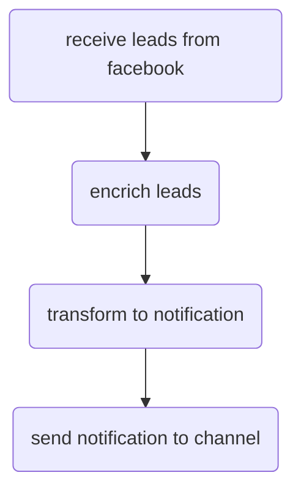

- Поддержка разных источников лидов
- Поддержка разных каналов для уведомлений

## Модули
### Facebook модуль.
Содержит логику, характерную только для Facebook. 
Компоненты:

<!--stackedit_data:
eyJoaXN0b3J5IjpbNDY0OTk5MjIzLDY3NDg1Njk2NSwtMTUxND
k5NTQyMiwyMTI1MTIxNDU1XX0=
-->