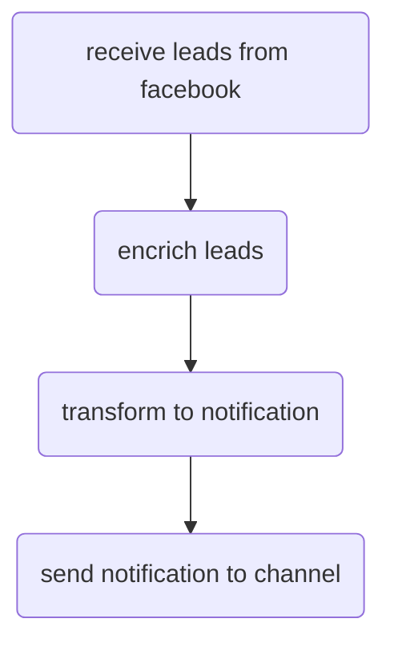
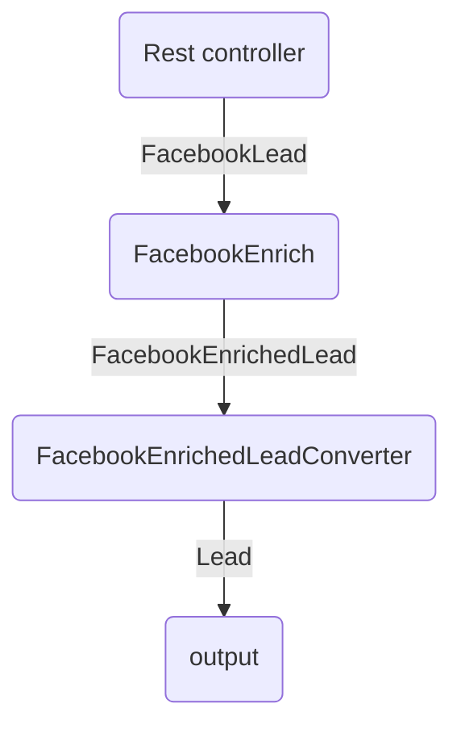

# Сервис уведомлений о лидах
##

- Поддержка разных источников лидов
- Поддержка разных каналов для уведомлений

## Модули
### Facebook модуль.
Содержит логику, характерную только для Facebook. 
Компоненты:
	- Rest контроллер/Webhook
	- Обогатитель лидов 

Facebook Module: 

<!--stackedit_data:
eyJoaXN0b3J5IjpbMTQ4NjMzOTIyMSw2NzQ4NTY5NjUsLTE1MT
Q5OTU0MjIsMjEyNTEyMTQ1NV19
-->