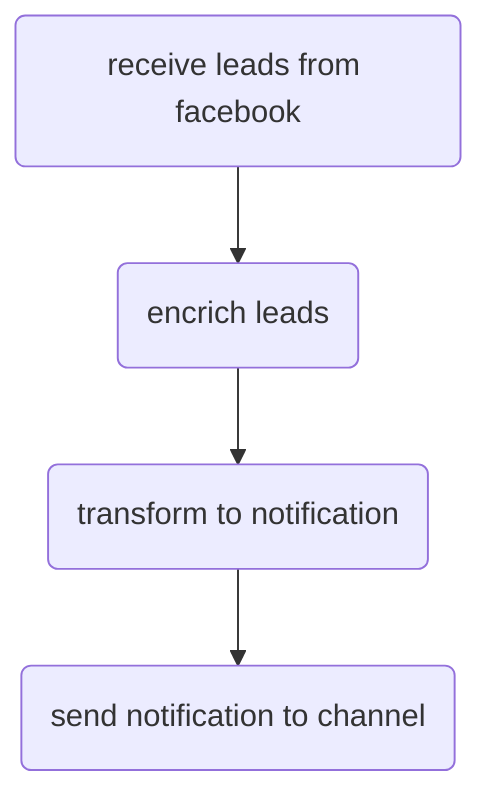

```mermaid
graph TD;
A(receive leads from facebook) --> B(encrich leads)
B --> C(transform to notification)
C --> D(send notification to channel)
```
<!--stackedit_data:
eyJoaXN0b3J5IjpbLTk3MTE0MTgzLDY3NDg1Njk2NSwtMTUxND
k5NTQyMiwyMTI1MTIxNDU1XX0=
-->