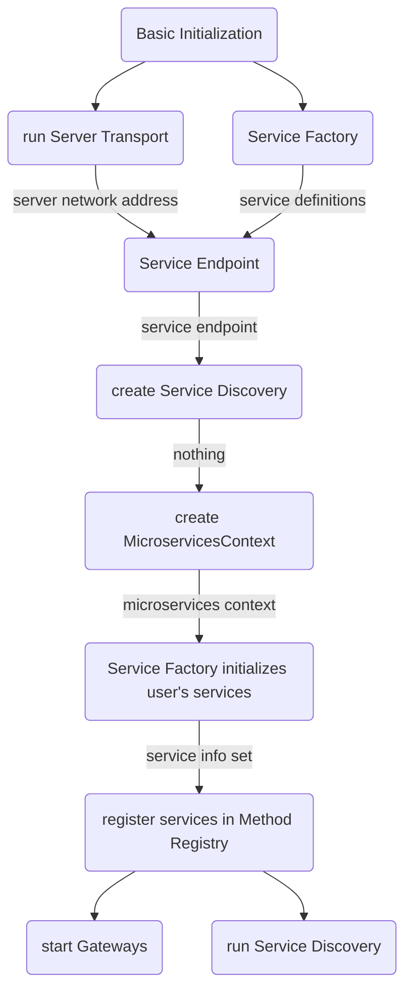

# Service Factory 

## Пользовательские сервисы, предоставляемые Scalecube узлом

### Введение 
Основное назначение любого Scalecube узла заключается в выполнении некоторой логики. 
За реализацию этой логики выступают Scalecube сервисы – объекты, которые реактивно обрабатывают поступающие данные и соответствуют определенным требованиям. 

### Описание API Scalecube сервисов 
API Scalecube сервиса декларативно описывается через java интерфейс. Данный интерфейс в общем случае используется для обращения к сервису:
```java
class Main {
	@Service
	interface GreetingService {
		@ServiceMethod
		Mono<String> sayHello();
	}
	
	public static void main(String[] args) {
		Microservices provider = //.. initialize node and register service
		GreetingService service = provider.api(GreetingService.class);
		service.sayHello().subscribe(out::println);
	}
}
```
Каждый Scalecube узел должен размещать не более одной реализации на каждый подобный интерфейс. 

> __Важно!__ Для одного интерфейса может быть только одна реализация в рамках одного Scalecube узла, так как на основе интерфейса генерируется адрес для обращения к API сервиса. 

К интерфейсу, декларирующему API сервиса, предоставляется ряд требований:
- иметь аннотацию `io.scalecube.services.annotations.Service` 
- имеет хотя бы один метод, который:
	- помечен аннотацией `io.scalecube.services.annotations.ServiceMethod`	
	- имеет 0...1 аргументов
	- соответствует одному из вариантов коммуникации

Вариантов коммуникации всего четыре:
- `Request Channel` – на поток событий получаем ответный поток событий.

	__Тип аргумента__:  `org.reactivestreams.Publisher<T>`, где тип `T`:
	- должен быть сериализуем через 
	указанный `io.scalecube.services.transport.api.DataCodec`
	- являться `ServiceMessage`. В этом случае необходимо использовать аннотацию `RequestType`.
	
	__Тип возвращаемого значения__:  `org.reactivestreams.Publisher<T>`, где тип `T`:
	- должен быть сериализуем через 
	указанный `io.scalecube.services.transport.api.DataCodec`
	- являться `ServiceMessage`. В этом случае необходимо использовать аннотацию `ResponseType`  для явного указания типа полезной нагрузки.

	Примеры:
	
	```java
	@ServiceMethod
	Flux<String> toUpperCase(Flux<String> input);
	```
	```java
	@ServiceMethod
	@ResponseType(String.class)
	Flux<ServiceMessage> toUpperCase(Flux<String> input);
	```
	```java
	@ServiceMethod
	@ResponseType(String.class)
	@RequestType(String.class)
	Flux<ServiceMessage> toUpperCase(Flux<ServiceMessage> input);
	```
	
- `Request Stream` – запрашиваем поток событий. 

	__Тип аргумента__:  Любой тип, удолетворяющий следующим условиям:
	- сериализуем через 
	указанный `io.scalecube.services.transport.api.DataCodec`
	- являющийся `ServiceMessage`. В этом случае необходимо использовать аннотацию `RequestType` для явного указания типа полезной нагрузки.
	
	__Тип возвращаемого значения__:  `org.reactivestreams.Publisher<T>`, где тип `T`:
	- должен быть сериализуем через 
	указанный `io.scalecube.services.transport.api.DataCodec`
	- являться `ServiceMessage`. В этом случае необходимо использовать аннотацию `ResponseType` для явного указания типа полезной нагрузки.

	Примеры:

	```java
	@ServiceMethod
	Flux<String> findById(String id);
	```
	```java
	@ServiceMethod
	@ResponseType(String.class)
	@RequestType(String.class)
	Flux<ServiceMessage> findById(ServiceMessage input);
	```

- `Request-Response` 
	
	Примеры:

	```java
	@ServiceMethod
	Mono<String> toUpperCase(Mono<String> input);
	```

- `Fire-and-forget` 

	Примеры:

	```java
	@ServiceMethod
	void fire(String message);
	```

### Порядок инициализации Scalecube узла


Рисунок 1 – Порядок инициализации Scalecube узла

### Service Factory как компонент управления жизненным циклом Scalecube сервисов

`ServiceFactory` это компонент Scalecube Services для управления жизненным циклом компонентов Scalecube узла. Но в отличие от, например, `Spring Core` 


<!--stackedit_data:
eyJoaXN0b3J5IjpbLTIxNDE0Mjg1MDUsLTE1MTQ5OTU0MjIsMj
EyNTEyMTQ1NV19
-->