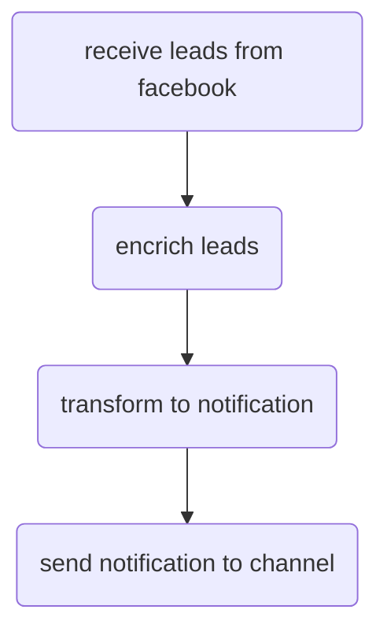

- Поддержка разных источников лидов
- Поддержка разных каналов для уведомлений

## Модули
### Facebook модуль.
Содержит логику, характерную только для Facebook. 
Компоненты:
	- Rest контроллер/Webhook
	- Обогатитель лидов 

Facebook Module: 
```mermaid
graph TD;
A(Rest controller) --
```
<!--stackedit_data:
eyJoaXN0b3J5IjpbLTEwNDMyNjg1MzgsNjc0ODU2OTY1LC0xNT
E0OTk1NDIyLDIxMjUxMjE0NTVdfQ==
-->