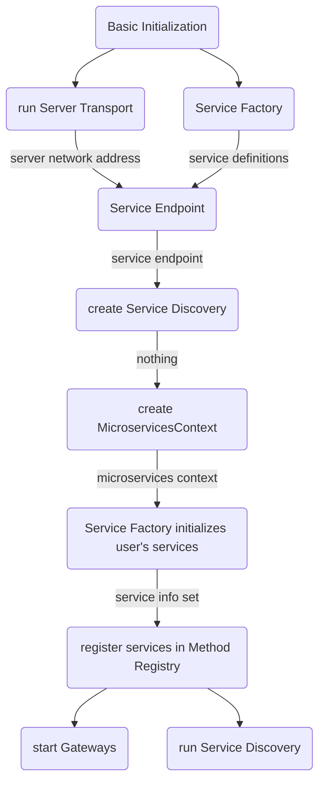

# Service Factory 

## Пользовательские сервисы, предоставляемые Scalecube узлом

### Введение 
Основное назначение любого Scalecube узла заключается в выполнении некоторой логики. 
За реализацию этой логики выступают Scalecube сервисы – объекты, которые реактивно обрабатывают поступающие данные и соответствуют определенным требованиям. 

### Особенности Scalecube сервисов
API Scalecube сервиса декларативно описывается через java интерфейс. Данный интерфейс в общем случае используется для обращения к сервису:
```java
Microservices seed = //.. initialize
seed.api(GreetingService.class).sayHello().s
Каждый Scalecube сервис должен реализовывать 
- Реализовывать интерфейс, который:
	- помечен аннотацией `io.scalecube.services.annotations.Service` 
	- имеет хотя бы один метод, который:
		- помечен аннотацией `io.scalecube.services.annotations.ServiceMethod`	
		- имеет 0...1 аргументов
		- соответствует одному из способу коммуникации

Коммуникационные способы:
- `Request Channel` – на поток событий получаем ответный поток событий.

	__Тип аргумента__:  `org.reactivestreams.Publisher<T>`, где тип `T`:
	- должен быть сериализуем через 
	указанный `io.scalecube.services.transport.api.DataCodec`
	- являться `ServiceMessage`. В этом случае необходимо использовать аннотацию `RequestType`.
	
	__Тип возвращаемого значения__:  `org.reactivestreams.Publisher<T>`, где тип `T`:
	- должен быть сериализуем через 
	указанный `io.scalecube.services.transport.api.DataCodec`
	- являться `ServiceMessage`. В этом случае необходимо использовать аннотацию `ResponseType`  для явного указания типа полезной нагрузки.

	Примеры:
	
	```java
	@ServiceMethod
	Flux<String> toUpperCase(Flux<String> input);
	```
	```java
	@ServiceMethod
	@ResponseType(String.class)
	Flux<ServiceMessage> toUpperCase(Flux<String> input);
	```
	```java
	@ServiceMethod
	@ResponseType(String.class)
	@RequestType(String.class)
	Flux<ServiceMessage> toUpperCase(Flux<ServiceMessage> input);
	```
	
- `Request Stream` – запрашиваем поток событий. 

	__Тип аргумента__:  Любой тип, удолетворяющий следующим условиям:
	- сериализуем через 
	указанный `io.scalecube.services.transport.api.DataCodec`
	- являющийся `ServiceMessage`. В этом случае необходимо использовать аннотацию `RequestType` для явного указания типа полезной нагрузки.
	
	__Тип возвращаемого значения__:  `org.reactivestreams.Publisher<T>`, где тип `T`:
	- должен быть сериализуем через 
	указанный `io.scalecube.services.transport.api.DataCodec`
	- являться `ServiceMessage`. В этом случае необходимо использовать аннотацию `ResponseType` для явного указания типа полезной нагрузки.

	Примеры:

	```java
	@ServiceMethod
	Flux<String> findById(String id);
	```
	```java
	@ServiceMethod
	@ResponseType(String.class)
	@RequestType(String.class)
	Flux<ServiceMessage> findById(ServiceMessage input);
	```

	


## Алгоритм инициализации Scalecube узла




<!--stackedit_data:
eyJoaXN0b3J5IjpbLTE2ODUwNDUxNzMsMjEyNTEyMTQ1NV19
-->